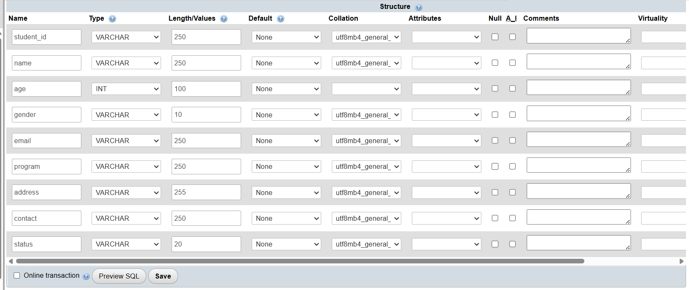

# Student Information System (Java + MySQL)

This is a console-based **Student Information System** developed in Java using JDBC for MySQL integration. It supports basic CRUD (Create, Read, Update, Delete) operations on student records.

## Requirements

- Java JDK 8 or above
- MySQL Server
- MySQL JDBC Driver
- A database named `student_system` with a `students` table
- 
[Download MySQL JDBC Driver](https://drive.google.com/file/d/1U1RQgCWTRJ6K3jvygbAUDsahtPeUX2am/view?usp=sharing)


[Download the source code](https://drive.google.com/drive/folders/1CeH1DAMb6bJdWgAwpsbkstw1QjDem5IV?usp=sharing)

### MySQL Database

**DATABASE NAME: student_system**

**TABLE NAME: students**

### Database Table Schema




### Java Source Code

```java

package studentsystem;

import java.sql.*;
import java.util.Scanner;

public class studentinformation {
    static final String url = "jdbc:mysql://localhost:3306/student_system";
    static final String username = "root";
    static final String password = "";

    static Connection con;
    static Scanner sc = new Scanner(System.in);

    private static void success(String message) {
        System.out.println("Sucsess: " + message);
    }

    private static void print(String message) {
        System.out.print(message);
    }

    private static void println(String message) {
        System.out.println(message);
    }

    private static void error(String message) {
        System.out.println("Error: " + message);
    }

    private static boolean confirm(String message) {
        System.out.print(message + " (yes/no): ");
        return new Scanner(System.in).nextLine().equalsIgnoreCase("yes");
    }

    public static void main(String[] args) {
        try {
            con = DriverManager.getConnection(url, username, password);
            boolean actions = true;

            while (actions) {
                System.out.println("\n=== Student Information System ===");
                println("1. Create Student Information");
                println("2. Update Student Information");
                println("3. View Student Information");
                println("4. Delete Student Information");
                println("5. Exit");
                print("Choose option: ");
                int option = Integer.parseInt(sc.nextLine());

                switch (option) {
                    case 1: Create(); break;
                    case 2: Update(); break;
                    case 3: View(); break;
                    case 4: Delete(); break;
                    case 5: actions = false; break;
                    default: error("Invalid choice."); break;
                }

                if (actions) {
                    actions = confirm("Do another action?");
                }
            }

            con.close();
            println("Goodbye.");
        } catch (SQLException e) {
            error(e.getMessage());
        }
    }

    private static void Create() {
        try {
            System.out.print("Student ID: ");
            String id = sc.nextLine();

            PreparedStatement cst = con.prepareStatement("SELECT * FROM students WHERE student_id = ?");
            cst.setString(1, id);
            ResultSet rs = cst.executeQuery();

            if (rs.next()) {
                error("Student ID already exists.");
                return;
            }

            print("Name: ");
            String name = sc.nextLine();
            print("Age: ");
            int age = Integer.parseInt(sc.nextLine());
            print("Gender: ");
            String gender = sc.nextLine();
            print("Email: ");
            String email = sc.nextLine();
            if (!email.endsWith("@paterostechnologicalcollege.edu.ph")) {
                error("Email must be a school email.");
                return;
            }
            print("Program: ");
            String program = sc.nextLine();
            print("Address: ");
            String address = sc.nextLine();
            print("Contact No.: ");
            String contact = sc.nextLine();
            print("Status: ");
            String status = sc.nextLine();

            String query = "INSERT INTO students (student_id, name, age, gender, email, program, address, contact, status) VALUES (?, ?, ?, ?, ?, ?, ?, ?, ?)";
            PreparedStatement pst = con.prepareStatement(query);
            pst.setString(1, id);
            pst.setString(2, name);
            pst.setInt(3, age);
            pst.setString(4, gender);
            pst.setString(5, email);
            pst.setString(6, program);
            pst.setString(7, address);
            pst.setString(8, contact);
            pst.setString(9, status);
            pst.executeUpdate();

            success("Student created successfully.");
        } catch (SQLException e) {
            error(e.getMessage());
        }
    }

private static void Update() {
    try {
        print("Enter Student ID: ");
        String id = sc.nextLine();

        PreparedStatement cst = con.prepareStatement("SELECT * FROM students WHERE student_id = ?");
        cst.setString(1, id);
        ResultSet rs = cst.executeQuery();

        if (!rs.next()) {
            error("Student not found.");
            return;
        }

        println("Select what to update:");
        println("1. Name\n2. Age\n3. Gender\n4. Program\n5. Email\n6. Address\n7. Contact\n8. Status");
        print("Choice: ");

        int choice = Integer.parseInt(sc.nextLine());

        String[] fields = {"name", "age", "gender", "program", "email", "address", "contact", "status"};
        if (choice < 1 || choice > 8) {
            error("Invalid option.");
            return;
        }

        String column = fields[choice - 1];
        print("New value: ");
        String value = sc.nextLine();

        if (column.equals("email") && !value.endsWith("@paterostechnologicalcollege.edu.ph")) {
            error("Email must be a school email.");
            return;
        }

        println("\nYou are about to update " + column + " to: " + value);
        if (!confirm("Are you sure you want to proceed with the update?")) {
            println("Update cancelled.");
            return;
        }

        String sql = "UPDATE students SET " + column + " = ? WHERE student_id = ?";
        PreparedStatement pst = con.prepareStatement(sql);
        pst.setString(1, value);
        pst.setString(2, id);
        pst.executeUpdate();

        success("Student updated.");
    } catch (SQLException e) {
        error(e.getMessage());
    }
}


    private static void View() {
        try {
            print("Enter Student ID: ");
            String id = sc.nextLine();

            PreparedStatement pst = con.prepareStatement("SELECT * FROM students WHERE student_id = ?");
            pst.setString(1, id);
            ResultSet rs = pst.executeQuery();

            if (rs.next()) {
                println("\n--- Student Details ---");
                println("ID: " + rs.getString("student_id"));
                println("Name: " + rs.getString("name"));
                println("Age: " + rs.getInt("age"));
                println("Gender: " + rs.getString("gender"));
                println("Email: " + rs.getString("email"));
                println("Program: " + rs.getString("program"));
                println("Address: " + rs.getString("address"));
                println("Contact: " + rs.getString("contact"));
                println("Status: " + rs.getString("status"));
            } else {
                error("Student not found.");
            }
        } catch (SQLException e) {
            error(e.getMessage());
        }
    }

    private static void Delete() {
        try {
            print("Enter Student ID: ");
            String id = sc.nextLine();

            PreparedStatement cst = con.prepareStatement("SELECT * FROM students WHERE student_id = ?");
            cst.setString(1, id);
            ResultSet rs = cst.executeQuery();

            if (!rs.next()) {
                error("Student not found.");
                return;
            }

            if (confirm("Confirm delete?")) {
                PreparedStatement pst = con.prepareStatement("DELETE FROM students WHERE student_id = ?");
                pst.setString(1, id);
                pst.executeUpdate();
                success("Student deleted.");
            } else {
                println("Cancelled.");
            }
        } catch (SQLException e) {
            error(e.getMessage());
        }
    }
}

```